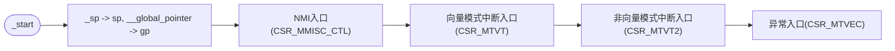

# Porting rt-thread to risc-v

## 目录

-   [rt-thread 简介](#rt-thread-简介)
-   [移植目标（最小目标）](#移植目标最小目标)
-   [移植步骤](#移植步骤)
-   [CPU 架构移植](#CPU-架构移植)
-   [risc-v简介](#risc-v简介)
    -   [RISC-V指令集](#RISC-V指令集)
    -   [RISC-V特权模式](#RISC-V特权模式)
    -   [RISC-V通用寄存器](#RISC-V通用寄存器)
    -   [异常响应](#异常响应)
    -   [异常退出](#异常退出)
    -   [NMI响应](#NMI响应)
    -   [NMI退出](#NMI退出)
    -   [中断控制器 ECLIC](#中断控制器-ECLIC)
    -   [中断响应](#中断响应)
    -   [中断退出](#中断退出)
    -   [中断、异常、 NMI 的嵌套](#中断异常-NMI-的嵌套)
-   [移植](#移植)
-   [链接脚本](#链接脚本)
-   [启动流程（堆栈，中断，异常，NMI配置）](#启动流程堆栈中断异常NMI配置)
-   [接口实现](#接口实现)

## rt-thread 简介


***

## 移植目标（最小目标）

-   调度器正常运行（上下文，异常，中断）
-   分配器正常运行
-   io正常运行（printf，中断）

***

## 移植步骤


-   os贴近硬件层面的实现需要依赖硬件提供的特性，因此cpu架构移植入需要关注riscv的相关硬件特性：
    -   中断，异常
    -   sp（堆栈模型）
    -   tick（可选tickless）
    -   调用过程

***

## CPU 架构移植

-   链接脚本
-   堆栈配置
-   中断（异常）配置（中断向量表，中断使用方式）
-   接口实现
-   tick实现

***

## risc-v简介

[Specifications – RISC-V International (riscv.org)](https://riscv.org/technical/specifications/ "Specifications – RISC-V International (riscv.org)")

***

### **RISC-V指令集**

RISC-V指令集由“基本指令集 + 扩展指令集”组成。基本指令集是必选的，扩展指令集是可选的。意思就是可以根据你的实际需求，选择需要使用的指令。例如在一个项目中，如果不需要用到压缩指令，那么就不需要把压缩指令添加进来，从而做到定制化，这也是RISC-V的一大特点。

RISC-V指令集有RV32I、RV32E、RV64I、RV64E、RV64I等等，RV代表RISC-V，32/64代表32位或64位，I和E都是基本指令集，在I和E的基础上，可以添加D（双精度浮点扩展）、M（整数乘除法）、A（原子扩展）、C（压缩扩展）等扩展指令。例如，在RV64I基础上，添加原子、整数乘除法、双精度浮点、压缩指令，则该指令集称为RV64IMADC。

基本指令集和扩展指令集描述如下：


***

### **RISC-V特权**模式

ARM v7有7种工作模式，ARM v8 有三种异常等级，而RISC-V也有不同的模式，这些模式在RISC-V中也被称为特权架构。

RISC-V总共有四种模式，分别是U、S、H（10）和M模式：


N 级别处理器内核支持用户模式和机器模式

***

**用户模式（User Mode）**： &#x20;

-   在 User Mode 下只能够访问 User Mode 限定的 CSR 寄存器。 &#x20;
-   在 User Mode 下只能够访问 PMP 设定权限的物理地址区域。

***

**机器子模式（Machine Sub-Mode）**（目前rtthread运行的模式）：

N 级别处理器内核的 Machine Mode 可能处于四种不同的状态下，将之称之为机器子模式 &#x20;

（Machine Sub-Mode）： &#x20;

-   正常机器模式： &#x20;
-   异常处理模式： &#x20;
-   NMI 处理模式：   &#x20;
-   中断处理模式：  &#x20;

***

### **RISC-V通用寄存器**

| 寄存器      | ABI名称  | 说明                        |
| -------- | ------ | ------------------------- |
| x0       | zero   | 0值寄存器，硬编码为0，写入数据忽略，读取数据为0 |
| x1       | ra     | 用于返回地址（return address）    |
| x2       | sp     | 用于栈指针（stack pointer）      |
| x3       | gp     | 用于通用指针（global pointer）    |
| x4       | tp     | 用于线程指针                    |
| x5       | t0     | 用于存放临时数据或者备用链接寄存器         |
| x6\~x7   | t1\~t2 | 用于存放临时数据寄存器               |
| x8       | s0/fp  | 需要保存的寄存器或者帧指针寄存器          |
| x9       | s1     | 需要保存寄存器                   |
| x10\~x11 | a0\~a1 | 函数参数或者返回值寄存器              |
| x12\~x17 | a2-a7  | 函数传递参数寄存器                 |
| x18\~x27 | s2-s11 | 需要保存的寄存器                  |
| x28\~x31 | t3\~t6 | 用于存放临时数据寄存器               |

***

### 异常响应


***

### 异常退出


***

### NMI响应


***

### NMI退出


***

### 中断控制器 ECLIC


***

### 中断响应


***

### 中断退出


***

### 中断、异常、 NMI 的嵌套

中断和异常能自我发生嵌套， NMI 无法自我嵌套： &#x20;

-   在 NMI 处理模式下，如果再次发生 NMI，新来的 NMI 会被屏蔽掉，因此， NMI 无法 &#x20;

自我嵌套。 &#x20;

-   在异常处理模式下，如果再次发生异常，这属于异常嵌套情形，请参见第 3.7 节了解详 &#x20;

情。 &#x20;

-   在中断处理模式下，如果再次发生中断，这属于中断嵌套情形，请参见第 5.11 节了解详 &#x20;

情。 &#x20;

***

中断、异常和 NMI 彼此之间也可能会发生嵌套，存在如下情形： &#x20;

-   在中断处理模式下发生了异常，则进入异常处理模式。 &#x20;
-   在 NMI 处理模式下发生了异常，则进入异常处理模式。 &#x20;
-   在中断处理模式下发生了 NMI， 则进入 NMI 处理模式。 &#x20;
-   在异常处理模式下发生了 NMI，则进入 NMI 处理模式。 &#x20;

注意： 在 NMI 和异常模式下默认由于全局中断位被硬件自动关闭，因此不会再响应中断。 &#x20;

为了能够保证异常和 NMI 彼此之间发生嵌套后还能够恢复到之前的状态（Recoverable）， N &#x20;

级别处理器内核实现了一种“两级 NMI/异常状态堆栈（Two Levels of NMI/Exception State Save &#x20;

Stacks）”技术，

***

## 移植


***

## 链接脚本

确定memory 范围以及使用方式（是否拷贝等）

```c
OUTPUT_ARCH( "riscv" )

ENTRY( _start )

MEMORY
{
  ilm (rxai!w) : ORIGIN = 0x61000000, LENGTH = 128K    /*memory map*/
  ram (wxa!ri) : ORIGIN = 0x61020000, LENGTH = 128K

}

```

***

## 启动流程（堆栈，中断，异常，NMI配置）



***

## 接口实现

```c
/* 关闭全局中断 */
rt_base_t rt_hw_interrupt_disable(void)

/* 打开全局中断 */
void rt_hw_interrupt_enable(rt_base_t level)

/* 没有来源的上下文切换，调度器启动第一个线程的时候调用 */


/* 初始化栈帧 */
rt_uint8_t *rt_hw_stack_init(void       *tentry,
                             void       *parameter,
                             rt_uint8_t *stack_addr,
                             void       *texit)


/* from线程切换到to线程， 线程上下文 */
void rt_hw_context_switch(rt_ubase_t from, rt_ubase_t to)

/* from线程切换到to线程，中断上下文 */
void rt_hw_context_switch_interrupt(rt_ubase_t from, rt_ubase_t to)

/* 表示需要在中断上下文中进行切换的标志 */
volatile rt_ubase_t rt_thread_switch_interrupt_fla

/* 在线程上下文切换的时候，用来保存from线程和to线程 */
volatile rt_ubase_t  rt_interrupt_from_thread 
volatile rt_ubase_t  rt_interrupt_to_thread

```

***
